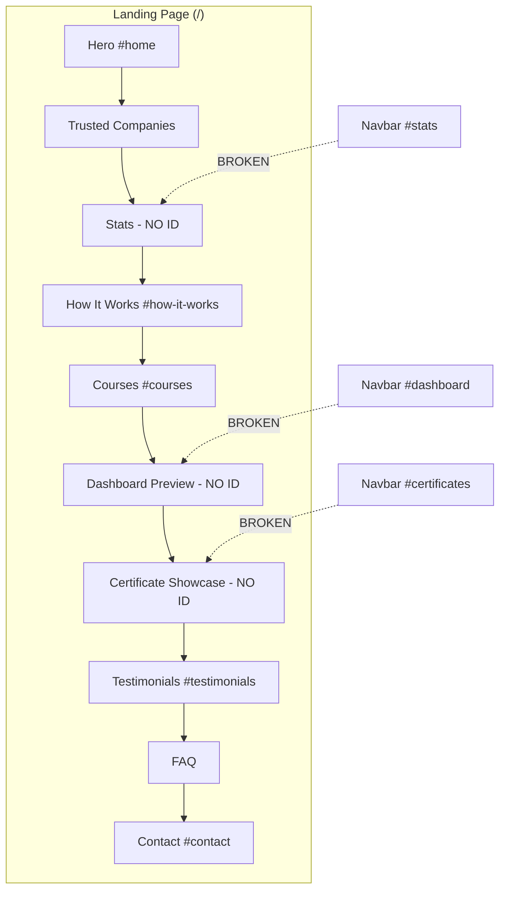
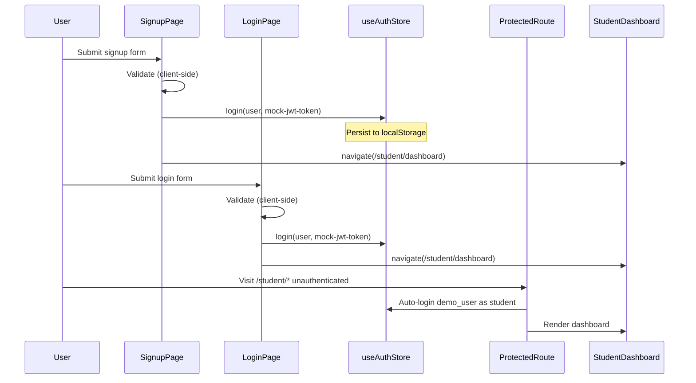

# Cloud Nexus LMS — Data Flow Diagram

> **Project:** Cloud Nexus Learning Management System (LMS)  
> **Stack:** React + Vite + React Router + Zustand (auth) + Framer Motion  
> **Entry point:** `src/main.jsx` → `src/App.jsx`  
> **Generated from codebase analysis**

---

## Table of Contents

1. [Primary User Journey](#1-primary-user-journey)
2. [Landing Page — Complete Flow](#2-landing-page--complete-flow)
3. [Authentication Flow](#3-authentication-flow)
4. [Student Dashboard Flow](#4-student-dashboard-flow)
5. [Public Pages Flow (Beyond Landing)](#5-public-pages-flow-beyond-landing)
6. [Route Map](#6-route-map)
7. [Auth & State Management](#7-auth--state-management)
8. [Component Status Summary](#8-component-status-summary)
9. [Mermaid Diagrams](#9-mermaid-diagrams)

---

## 1. Primary User Journey

This is the main onboarding path a new user follows from the landing page to the student dashboard.

### Expected vs Actual Behavior

| Step | User Action | Expected Flow (Ideal) | **Actual Implementation** | Status |
|------|-------------|----------------------|----------------------------|--------|
| 1 | Lands on homepage | `/` | `/` | ✅ Working |
| 2 | Clicks **Get Started** (Navbar) or **Start free trial** (Hero) | → `/signup` | → `/signup` | ✅ Working |
| 3 | Fills signup form & submits | → `/login` (after success) | → **`/student/dashboard`** (auto-login, skips login) | ⚠️ Partial — works but skips login step |
| 4 | Logs in on login page | → `/student/dashboard` | → `/student/dashboard` | ✅ Working |
| 5 | Views student dashboard | Protected student area | Protected student area | ✅ Working |

> **Note:** After successful registration, the app **does not redirect to `/login`**. It calls `useAuthStore.login()` with a mock token and navigates directly to `/student/dashboard`. The login page is only reached manually via Navbar "Log in" or the "Sign In" link on the signup page.

### Primary Journey Diagram

```
┌─────────────────────────────────────────────────────────────────────────────┐
│                         PRIMARY USER JOURNEY                                │
└─────────────────────────────────────────────────────────────────────────────┘

  Landing Page (/)
       │
       ├── [Get Started] Navbar ──────────────┐
       ├── [Start free trial] Hero ───────────┤
       ├── [Start your free trial] Demo page ─┤
       └── [Buy Now] Track detail page ───────┤
                                               ▼
                                        Signup Page (/signup)
                                               │
                          ┌────────────────────┼────────────────────┐
                          │                    │                    │
                    [Sign In link]      [Form Submit]         [Google/GitHub]
                          │                    │                    │
                          ▼                    ▼                    ▼
                   Login Page            Mock API delay         ❌ NOT WORKING
                   (/login)              (1.5 seconds)          (no handlers)
                          │                    │
                          │              useAuthStore.login()
                          │              role: "student"
                          │              token: "mock-jwt-token"
                          │                    │
                          │                    ▼
                          │         Student Dashboard (/student/dashboard)
                          │                    ▲
                          └──── [Form Submit] ─┘
                                 Mock API delay (1.2s)
                                 → same redirect
```

---

## 2. Landing Page — Complete Flow

**Route:** `/`  
**Layout:** `PublicLayout` (Navbar + page content + Footer)  
**File:** `src/pages/LandingPage.jsx`

### Page Structure (Top to Bottom)

| # | Section | Component File | Section ID | Status |
|---|---------|----------------|------------|--------|
| 1 | Hero | `src/components/sections/Hero.jsx` | `#home` | ✅ Working |
| 2 | Trusted Companies | `src/components/sections/TrustedCompanies.jsx` | — | ✅ Working (static) |
| 3 | Stats | `src/components/sections/Stats.jsx` | — (no ID) | ⚠️ Navbar links `#stats` but section has no ID |
| 4 | How It Works | `src/components/sections/HowItWorks.jsx` | `#how-it-works` | ✅ Working |
| 5 | Courses | `src/components/sections/Courses.jsx` | `#courses` | ✅ Working |
| 6 | Dashboard Preview | `src/components/sections/DashboardPreview.jsx` | — (no ID) | ⚠️ Navbar links `#dashboard` but section has no ID |
| 7 | Certificate Showcase | `src/components/sections/CertificateShowcase.jsx` | — (no ID) | ⚠️ Navbar links `#certificates` but section has no ID |
| 8 | Testimonials | `src/components/sections/TestimonialScroll.jsx` | `#testimonials` | ✅ Working |
| 9 | FAQ | `src/components/sections/FAQ.jsx` | — | ✅ Working (accordion only) |
| 10 | Contact | `src/components/sections/Contact.jsx` | `#contact` | ⚠️ Form submit is UI-only (no backend) |

---

### 2.1 Navbar (`src/components/layout/Navbar.jsx`)

| Element | Action | Destination | Status |
|---------|--------|-------------|--------|
| Logo | Click | `/` (scroll to top) | ✅ Working |
| **Get Started** (desktop & mobile) | Click | `/signup` | ✅ Working |
| **Log in** (desktop & mobile) | Click | `/login` | ✅ Working |
| Theme toggle | Click | Toggles dark/light theme | ✅ Working |
| Mobile menu toggle | Click | Opens/closes drawer | ✅ Working |

#### Navbar Dropdown — Explore

| Item | Destination | Status |
|------|-------------|--------|
| How it works | `#how-it-works` | ✅ Working |
| Dashboard preview | `#dashboard` | ❌ **NOT WORKING** — no matching section ID on page |

#### Navbar Dropdown — Courses

| Item | Destination | Status |
|------|-------------|--------|
| All courses | `/tracks` | ✅ Working |
| Certificates | `#certificates` | ❌ **NOT WORKING** — no matching section ID on page |

#### Navbar Dropdown — Mentors

| Item | Destination | Status |
|------|-------------|--------|
| Meet the mentors | `/mentors` | ✅ Working |
| Community | `#stats` | ❌ **NOT WORKING** — Stats section has no `id="stats"` |

#### Navbar — Contact

| Item | Destination | Status |
|------|-------------|--------|
| Contact | `#contact` | ✅ Working |

---

### 2.2 Hero Section (`src/components/sections/Hero.jsx`)

| Element | Label | Destination | Status |
|---------|-------|-------------|--------|
| Primary CTA | **Start free trial** | `/signup` | ✅ Working |
| Secondary CTA | **Watch demo** | `/demo` | ✅ Working |
| LMS visual / progress strip | Display only | — | ✅ Working (decorative) |

---

### 2.3 Trusted Companies Section

| Element | Action | Status |
|---------|--------|--------|
| Company logos | Display only | ✅ Working (static logos) |

---

### 2.4 Stats Section (`src/components/sections/Stats.jsx`)

| Element | Action | Status |
|---------|--------|--------|
| Animated counters | Display only | ✅ Working |
| Navbar anchor `#stats` | Scroll target | ❌ **NOT WORKING** — section missing `id="stats"` |

---

### 2.5 How It Works Section (`src/components/sections/HowItWorks.jsx`)

| Element | Action | Status |
|---------|--------|--------|
| Step cards | Display only | ✅ Working |
| Navbar anchor `#how-it-works` | Scroll target | ✅ Working |

---

### 2.6 Courses Section (`src/components/sections/Courses.jsx`)

| Element | Action | Destination | Status |
|---------|--------|-------------|--------|
| Course card (carousel) | Click | `/tracks/:trackId` | ✅ Working |
| Carousel prev/next | Click | Scrolls carousel | ✅ Working |
| **Browse all N career tracks** | Click | `/tracks` | ✅ Working |
| Navbar anchor `#courses` | Scroll target | ✅ Working |

---

### 2.7 Dashboard Preview Section

| Element | Action | Status |
|---------|--------|--------|
| Dashboard mockup UI | Display only | ✅ Working |
| Navbar anchor `#dashboard` | Scroll target | ❌ **NOT WORKING** — section missing `id="dashboard"` |

---

### 2.8 Certificate Showcase Section

| Element | Action | Status |
|---------|--------|--------|
| Certificate animation | Display only | ✅ Working |
| Navbar anchor `#certificates` | Scroll target | ❌ **NOT WORKING** — section missing `id="certificates"` |

---

### 2.9 Testimonials Section (`src/components/sections/TestimonialScroll.jsx`)

| Element | Action | Status |
|---------|--------|--------|
| Auto-scrolling testimonials | Display only | ✅ Working |
| Navbar anchor `#testimonials` | Scroll target | ✅ Working |

---

### 2.10 FAQ Section (`src/components/sections/FAQ.jsx`)

| Element | Action | Status |
|---------|--------|--------|
| Accordion expand/collapse | Click | ✅ Working |
| External links | — | N/A (none) |

---

### 2.11 Contact Section (`src/components/sections/Contact.jsx`)

| Element | Action | Result | Status |
|---------|--------|--------|--------|
| Contact form submit | Submit | Shows success message locally | ⚠️ **NOT WORKING** (no API — cosmetic only) |
| Email link | Click | `mailto:hello@cloudnexus.io` | ✅ Working |
| Phone link | Click | `tel:+12025550100` | ✅ Working |
| Navbar anchor `#contact` | Scroll target | ✅ Working |

---

### 2.12 Footer (`src/components/layout/Footer.jsx`)

#### Courses Column

| Link | Destination | Status |
|------|-------------|--------|
| Browse All Courses | `/tracks` | ✅ Working |
| Categories | `#` | ❌ **NOT WORKING** (placeholder) |
| Certifications | `/student/certificates` | ✅ Working (requires auth / auto-login) |
| Live Classes | `#` | ❌ **NOT WORKING** (placeholder) |
| Free Courses | `#` | ❌ **NOT WORKING** (placeholder) |
| Learning Paths | `/tracks` | ✅ Working |
| Skill Assessments | `#` | ❌ **NOT WORKING** (placeholder) |
| Enterprise Plans | `#` | ❌ **NOT WORKING** (placeholder) |

#### For Students Column

| Link | Destination | Status |
|------|-------------|--------|
| My Dashboard | `/student/dashboard` | ✅ Working |
| My Courses | `/student/courses` | ✅ Working |
| Assignments | `#` | ❌ **NOT WORKING** (placeholder) |
| Certificates | `/student/certificates` | ✅ Working |
| Discussion Forums | `#` | ❌ **NOT WORKING** (placeholder) |
| Mobile App | `#` | ❌ **NOT WORKING** (placeholder) |
| Student Support | `#` | ❌ **NOT WORKING** (placeholder) |

#### For Instructors Column

| Link | Destination | Status |
|------|-------------|--------|
| Teach on CloudNexus | `/signup` | ✅ Working |
| Instructor Portal | `/mentor/dashboard` | ✅ Working (auto-login as mentor) |
| Course Builder | `/mentor/upload` | ✅ Working |
| Analytics | `/mentor/analytics` | ✅ Working |
| Payouts | `/mentor/revenue` | ✅ Working |
| Instructor Community | `#` | ❌ **NOT WORKING** (placeholder) |

#### Resources Column

| Link | Status |
|------|--------|
| All links (Help Center, Blog, Webinars, etc.) | ❌ **NOT WORKING** (all `href="#"` placeholders) |

#### Social Links

| Platform | Status |
|----------|--------|
| Facebook, X, Instagram | ❌ **NOT WORKING** (`href="#"`) |
| LinkedIn | ✅ Working (external URL) |

---

## 3. Authentication Flow

### 3.1 Signup (`/signup`)

**File:** `src/pages/SignupPage.jsx`  
**Layout:** `AuthLayout`

```
User fills form (username, email, password, confirmPassword)
        │
        ▼
Client-side validation
        │
        ├── FAIL → Show field errors (stays on page)
        │
        └── PASS → Loading state (1.5s simulated delay)
                        │
                        ▼
              useAuthStore.login({
                username, email, fullName, role: "student"
              }, "mock-jwt-token")
                        │
                        ▼
              navigate("/student/dashboard")   ← skips /login
```

| Feature | Status |
|---------|--------|
| Form validation | ✅ Working |
| Password strength meter | ✅ Working |
| Sign Up button | ✅ Working |
| "Sign In" link → `/login` | ✅ Working |
| Google / GitHub buttons | ❌ **NOT WORKING** (no `onClick` handlers) |
| Real API registration | ❌ **NOT WORKING** (mock `setTimeout` only) |
| Redirect to login after signup | ❌ **NOT IMPLEMENTED** (goes straight to dashboard) |

---

### 3.2 Login (`/login`)

**File:** `src/pages/LoginPage.jsx`  
**Layout:** `AuthLayout`

```
User fills form (username, password)
        │
        ▼
Client-side validation
        │
        ├── FAIL → Show field errors
        │
        └── PASS → Loading state (1.2s simulated delay)
                        │
                        ▼
              useAuthStore.login({
                username, fullName, role: "student", rememberMe
              }, "mock-jwt-token")
                        │
                        ▼
              navigate("/student/dashboard")
```

| Feature | Status |
|---------|--------|
| Form validation | ✅ Working |
| Remember me checkbox | ⚠️ Stored in user object only (no special persistence logic) |
| Forgot Password link | ✅ Working (navigates to `/forgot-password`) |
| "Sign Up" link → `/signup` | ✅ Working |
| Google / GitHub buttons | ❌ **NOT WORKING** |
| Real API login | ❌ **NOT WORKING** (mock only) |
| Redirect to dashboard | ✅ Working |

---

### 3.3 Forgot Password (`/forgot-password`)

**File:** `src/pages/ForgotPasswordPage.jsx`

```
User enters email → clicks "Send OTP"
        │
        ▼
Navigates to /verify-otp (Link, not form submit)
```

| Feature | Status |
|---------|--------|
| Email input | ✅ UI only |
| Email validation before OTP | ❌ **NOT WORKING** |
| Send OTP (API) | ❌ **NOT WORKING** (just a navigation link) |
| Back to login link | ❌ **NOT IMPLEMENTED** |

---

### 3.4 OTP Verification (`/verify-otp`)

**File:** `src/pages/OtpVerificationPage.jsx`

```
User enters 4-digit OTP → clicks "Verify OTP"
        │
        ▼
Nothing happens (no submit handler)
```

| Feature | Status |
|---------|--------|
| OTP input (auto-focus next) | ✅ Working (UI) |
| Verify OTP button | ❌ **NOT WORKING** (no submit handler, no redirect) |
| Resend OTP | ❌ **NOT WORKING** (no handler) |
| OTP API validation | ❌ **NOT WORKING** |

---

### 3.5 Protected Routes

**File:** `src/components/layout/ProtectedRoute.jsx`

```
User visits /student/* | /mentor/* | /admin/*
        │
        ├── Not authenticated?
        │       └── Auto-login as demo_user with role from URL path
        │
        ├── Wrong role for route?
        │       └── Auto-switch role to match route
        │
        └── Render child route (Outlet)
```

| Feature | Status |
|---------|--------|
| Route protection (real gate) | ❌ **NOT WORKING** — demo mode auto-authenticates everyone |
| Role-based access | ⚠️ Bypassed — role auto-switches to match URL |
| Logout | ❌ **NOT IMPLEMENTED** — `logout()` exists in store but no UI calls it |

---

## 4. Student Dashboard Flow

**Entry:** `/student/dashboard` (after login/signup or direct URL with auto-login)  
**Layout:** `DashboardLayout` (`src/features/dashboard/components/DashboardLayout.jsx`)

### 4.1 Dashboard Shell

| Component | File | Purpose | Status |
|-----------|------|---------|--------|
| Sidebar | `DashboardSidebar.jsx` | Navigation | ✅ Working |
| Topbar | `DashboardTopbar.jsx` | Search, notifications, profile | ⚠️ Partial |
| Main content | Per-page component | Page body | ✅ Working (mock data) |

#### Topbar Actions

| Element | Destination | Status |
|---------|-------------|--------|
| Search input | — | ❌ **NOT WORKING** (no search logic) |
| Notifications bell | `/{role}/notifications` | ✅ Working |
| Avatar | `/{role}/profile` | ✅ Working |
| Theme toggle | Toggles theme | ✅ Working |
| 12 Day Streak badge | Display only | ✅ Working (static) |

---

### 4.2 Sidebar Navigation (Student)

| Nav Item | Route | In Sidebar | Status |
|----------|-------|------------|--------|
| Dashboard | `/student/dashboard` | ✅ Visible | ✅ Working |
| My Courses | `/student/courses` | ✅ Visible | ✅ Working (mock data) |
| Wishlist | `/student/wishlist` | ✅ Visible | ⚠️ Always empty state |
| Certificates | `/student/certificates` | ✅ Visible | ✅ Working (mock data) |
| Notes | `/student/notes` | ❌ Hidden (commented out) | ✅ Route works (mock data) |
| Billing | `/student/billing` | ❌ Hidden (commented out) | ✅ Route works (static UI) |
| Settings | `/student/settings` | ✅ Footer link | ⚠️ Save is cosmetic only |
| Notifications | `/student/notifications` | Via topbar only | ✅ Working (static data) |
| Profile | `/student/profile` | Via avatar only | ⚠️ Hardcoded "Alex Chen", not from auth store |
| Quiz Results | `/student/quiz` | Not in sidebar | ✅ Working (static data) |

---

### 4.3 Student Dashboard Page (`/student/dashboard`)

**File:** `src/pages/student/StudentDashboardPage.jsx`

| Quick Action | Destination | Status |
|--------------|-------------|--------|
| Continue Course | `/learn/cloud` | ✅ Working |
| Join Live Class | `/student/notifications` | ✅ Working |
| Submit Assignment | `/student/courses` | ✅ Working |
| View Certificates | `/student/certificates` | ✅ Working |

| Data | Source | Status |
|------|--------|--------|
| Stats, progress, upcoming events | Hardcoded constants | ✅ UI Working (not live data) |
| User name "Kunal" | Hardcoded | ⚠️ Not connected to auth store |

---

### 4.4 My Courses (`/student/courses`)

```
Load MOCK_COURSES (simulated delay)
        │
        ▼
Display course cards
        │
        └── Click course → /learn/:trackId
```

| Feature | Status |
|---------|--------|
| Course list display | ✅ Working (mock) |
| Continue learning link | ✅ Working |
| Real enrollment data | ❌ **NOT WORKING** |

---

### 4.5 Learning Player (`/learn/:trackId` and `/learn/:trackId/:lessonId`)

**File:** `src/pages/LessonPlayerPage.jsx`  
**Auth:** None (public route)

```
/learn/:trackId
        │
        ├── Valid track → Lesson player UI
        ├── Invalid track → redirect /tracks
        └── /learn/:trackId/:lessonId → specific lesson
```

| Feature | Status |
|---------|--------|
| Video player | ✅ Working |
| Lesson sidebar outline | ✅ Working |
| Notes autosave | ✅ Working (local storage) |
| Course progress | ✅ Working (local storage) |
| Auth required | ❌ Not enforced (anyone can access) |

---

### 4.6 Student Sub-Pages Summary

| Route | Page | Data Source | Status |
|-------|------|-------------|--------|
| `/student/wishlist` | StudentWishlistPage | Empty array | ⚠️ UI works, always empty |
| `/student/certificates` | CertificatesPage | `MOCK_CERTS` | ✅ Working (demo) |
| `/student/notes` | NotesAndBookmarksPage | `MOCK_NOTES` | ✅ Working (demo) |
| `/student/quiz` | QuizResultsPage | `QUIZ_DATA` | ✅ Working (demo) |
| `/student/billing` | BillingSubscriptionPage | `INVOICES` | ✅ Working (demo) |
| `/student/notifications` | NotificationsPage | `NOTIFICATIONS` | ✅ Working (demo) |
| `/student/profile` | ProfilePage | `PROFILE` constant | ⚠️ Not synced with auth |
| `/student/settings` | ProfileSettingsPage | Local state | ⚠️ Save = toast only |

---

## 5. Public Pages Flow (Beyond Landing)

### 5.1 Demo Page (`/demo`)

**File:** `src/pages/DemoPage.jsx`

| Element | Destination | Status |
|---------|-------------|--------|
| Back to home | `/` | ✅ Working |
| Play demo video | YouTube embed (inline) | ✅ Working |
| Start your free trial | `/signup` | ✅ Working |

---

### 5.2 Tracks List (`/tracks`)

**File:** `src/pages/TracksListPage.jsx`

| Element | Destination | Status |
|---------|-------------|--------|
| Track card | `/tracks/:id` | ✅ Working |

---

### 5.3 Track Detail (`/tracks/:id`)

**File:** `src/pages/TrackDetailPage.jsx`

| Element | Destination | Status |
|---------|-------------|--------|
| **Buy Now** | `/signup` | ✅ Working |
| **Learn More** | `/learn/:trackId` | ✅ Working (opens lesson player, not info page) |
| Curriculum, projects sections | Display only | ✅ Working |

---

### 5.4 Mentors List (`/mentors`)

**File:** `src/pages/MentorsListPage.jsx`

| Element | Destination | Status |
|---------|-------------|--------|
| Mentor card | `/mentors/:slug` | ✅ Working |

---

### 5.5 Mentor Detail (`/mentors/:slug`)

**File:** `src/pages/MentorDetailPage.jsx`

| Element | Destination | Status |
|---------|-------------|--------|
| Valid slug | Mentor profile page | ✅ Working |
| Invalid slug | Redirect `/` | ✅ Working |

---

### 5.6 404 Not Found (`*`)

**File:** `src/pages/NotFoundPage.jsx`  
**Status:** ✅ Working

---

## 6. Route Map

### Public Routes (no auth)

| Path | Component |
|------|-----------|
| `/` | LandingPage |
| `/demo` | DemoPage |
| `/mentors` | MentorsListPage |
| `/mentors/:slug` | MentorDetailPage |
| `/tracks` | TracksListPage |
| `/tracks/:id` | TrackDetailPage |
| `/learn/:trackId` | LessonPlayerPage |
| `/learn/:trackId/:lessonId` | LessonPlayerPage |

### Auth Routes (no layout shell beyond AuthLayout)

| Path | Component |
|------|-----------|
| `/login` | LoginPage |
| `/signup` | SignupPage |
| `/forgot-password` | ForgotPasswordPage |
| `/verify-otp` | OtpVerificationPage |

### Student Routes (ProtectedRoute + DashboardLayout)

| Path | Component |
|------|-----------|
| `/student` | → `/student/dashboard` |
| `/student/dashboard` | StudentDashboardPage |
| `/student/courses` | MyCoursesPage |
| `/student/learn` | → `/learn/cloud` (hardcoded) |
| `/student/certificates` | CertificatesPage |
| `/student/wishlist` | StudentWishlistPage |
| `/student/notes` | NotesAndBookmarksPage |
| `/student/settings` | ProfileSettingsPage |
| `/student/billing` | BillingSubscriptionPage |
| `/student/notifications` | NotificationsPage |
| `/student/profile` | ProfilePage |
| `/student/quiz` | QuizResultsPage |

### Mentor Routes

| Path | Component |
|------|-----------|
| `/mentor/dashboard` | MentorDashboardPage |
| `/mentor/upload` | UploadCoursePage |
| `/mentor/lessons` | ManageLessonsPage |
| `/mentor/revenue` | RevenuePage |
| `/mentor/analytics` | AnalyticsPage |
| `/mentor/students` | StudentsPage |
| `/mentor/notifications` | MentorNotificationsPage |
| `/mentor/profile` | ProfileSettingsPage |

### Admin Routes

| Path | Component |
|------|-----------|
| `/admin/dashboard` | AdminDashboardPage |
| `/admin/users` | UserManagementPage |
| `/admin/approvals` | CourseApprovalsPage |
| `/admin/revenue` | FinancialsPage |
| `/admin/reports` | AdminReportsPage |
| `/admin/settings` | SystemSettingsPage |
| `/admin/notifications` | AdminNotificationsPage |
| `/admin/profile` | AdminProfilePage |

---

## 7. Auth & State Management

**Store:** `src/store/useAuthStore.js` (Zustand + localStorage persist)

```
┌──────────────────────────────────────────┐
│           useAuthStore (Zustand)          │
├──────────────────────────────────────────┤
│  user: { username, email, fullName,     │
│          role, rememberMe } | null       │
│  isAuthenticated: boolean                │
│  token: string | null                    │
├──────────────────────────────────────────┤
│  login(userData, token)                  │
│  logout()                                │
│  updateUser(updates)                     │
├──────────────────────────────────────────┤
│  Persisted to: localStorage              │
│  Key: "cloud-nexus-auth"                 │
└──────────────────────────────────────────┘
```

**Used in:** `LoginPage`, `SignupPage`, `ProtectedRoute`  
**Not used in:** `ProfilePage`, `StudentDashboardPage`, `DashboardTopbar` (hardcoded user data)

---

## 8. Component Status Summary

### ✅ Working (Functional UI + Navigation)

- Landing page rendering and section scroll (where IDs exist)
- Navbar Get Started → Signup
- Navbar Log in → Login
- Hero CTAs (Start free trial, Watch demo)
- Courses carousel and track links
- Signup form validation and redirect to dashboard
- Login form validation and redirect to dashboard
- Student dashboard and all routed student pages (with mock data)
- Lesson player with video, notes, progress
- Tracks, mentors, demo pages
- Theme toggle (global)
- 404 page

### ⚠️ Partially Working

- **Signup → Dashboard** (works but skips login step you may expect)
- **Protected routes** (accessible without real login — demo auto-auth)
- **Remember me** (stored but no special behavior)
- **Contact form** (shows success UI, no backend)
- **Profile / Dashboard user name** (hardcoded, not from auth store)
- **Settings save** (toast only)
- **Wishlist** (UI works, always empty)
- **Notes & Billing routes** (exist but hidden from sidebar)

### ❌ Not Working

| Component / Feature | Issue |
|-------------------|-------|
| Google / GitHub OAuth | Buttons have no handlers |
| Real API auth (login/signup) | Mock `setTimeout` only |
| Signup → Login redirect | Goes directly to dashboard |
| Forgot password flow | No email validation, no API |
| OTP verification | Verify & Resend buttons do nothing |
| Logout | No UI to call `logout()` |
| Navbar `#dashboard` anchor | Section has no matching ID |
| Navbar `#certificates` anchor | Section has no matching ID |
| Navbar `#stats` anchor | Stats section has no ID |
| Footer placeholder links (`#`) | ~20+ links go nowhere |
| Social auth buttons (Facebook, X, Instagram) | `href="#"` |
| Dashboard search | No search implementation |
| Contact form backend | No API call |
| Auth store ↔ Profile sync | Disconnected |

---

## 9. Mermaid Diagrams

### 9.1 Complete Landing → Student Dashboard Flow

```mermaid
flowchart TD
    A[Landing Page /] --> B{User Action}

    B -->|Get Started - Navbar| C[/signup]
    B -->|Start free trial - Hero| C
    B -->|Watch demo| D[/demo]
    B -->|Log in| E[/login]
    B -->|Course card| F[/tracks/:id]
    B -->|Browse all tracks| G[/tracks]
    B -->|Meet mentors| H[/mentors]
    B -->|#how-it-works| I[Scroll to section]
    B -->|#contact| J[Scroll to Contact]

    D -->|Start free trial| C
    F -->|Buy Now| C
    F -->|Learn More| K[/learn/:trackId]

    C -->|Form submit success| L[Mock login + 1.5s delay]
    L --> M[/student/dashboard]

    E -->|Form submit success| N[Mock login + 1.2s delay]
    N --> M

    C -->|Sign In link| E
    E -->|Sign Up link| C
    E -->|Forgot Password| O[/forgot-password]
    O -->|Send OTP link| P[/verify-otp]

    M --> Q[Student Sidebar Nav]
    Q --> R[/student/courses]
    Q --> S[/student/certificates]
    Q --> T[/student/wishlist]
    Q --> U[/student/settings]
    R --> K

    style P fill:#ffcccc
    style O fill:#fff3cd
```

### 9.2 Landing Page Section Map



### 9.3 Auth State Flow



### 9.4 Student Dashboard Internal Flow

```mermaid
flowchart LR
    subgraph DashboardLayout
        SB[Sidebar]
        TB[Topbar]
        MAIN[Page Content]
    end

    SB --> DASH[/student/dashboard]
    SB --> COURSES[/student/courses]
    SB --> WISH[/student/wishlist]
    SB --> CERT[/student/certificates]
    SB --> SET[/student/settings]

    TB --> NOTIF[/student/notifications]
    TB --> PROF[/student/profile]

    DASH -->|Continue Course| LEARN[/learn/cloud]
    COURSES -->|Course card| LEARN
    DASH -->|View Certificates| CERT
```

---

## File Reference Index

| Concern | Path |
|---------|------|
| App entry | `src/main.jsx` |
| All routes | `src/App.jsx` |
| Auth store | `src/store/useAuthStore.js` |
| Route guard | `src/components/layout/ProtectedRoute.jsx` |
| Public shell | `src/components/layout/PublicLayout.jsx` |
| Navbar | `src/components/layout/Navbar.jsx` |
| Footer | `src/components/layout/Footer.jsx` |
| Auth shell | `src/components/layout/AuthLayout.jsx` |
| Landing page | `src/pages/LandingPage.jsx` |
| Hero CTAs | `src/components/sections/Hero.jsx` |
| Login | `src/pages/LoginPage.jsx` |
| Signup | `src/pages/SignupPage.jsx` |
| Forgot password | `src/pages/ForgotPasswordPage.jsx` |
| OTP verification | `src/pages/OtpVerificationPage.jsx` |
| Social auth buttons | `src/components/auth/SocialAuthButtons.jsx` |
| Dashboard layout | `src/features/dashboard/components/DashboardLayout.jsx` |
| Student sidebar | `src/features/dashboard/components/DashboardSidebar.jsx` |
| Student dashboard | `src/pages/student/StudentDashboardPage.jsx` |
| Lesson player | `src/pages/LessonPlayerPage.jsx` |

---

*This document reflects the current codebase state. To align signup with a login redirect, update `SignupPage.jsx` to navigate to `/login` instead of `/student/dashboard` after registration.*
